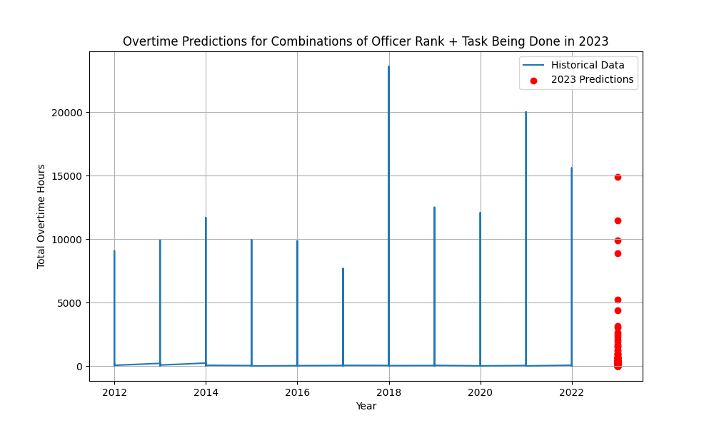

## Guiding Question

Given previous overtime data, predict the amount of overtime paid for the next year. How does this compare with the budget allocation for the BPD?

---

## Preliminary Data Visualizations

---

## Description of Data Processing

---

## Description of Data Modeling Methods

---

## Preliminary Results

---

## Video Presentation
