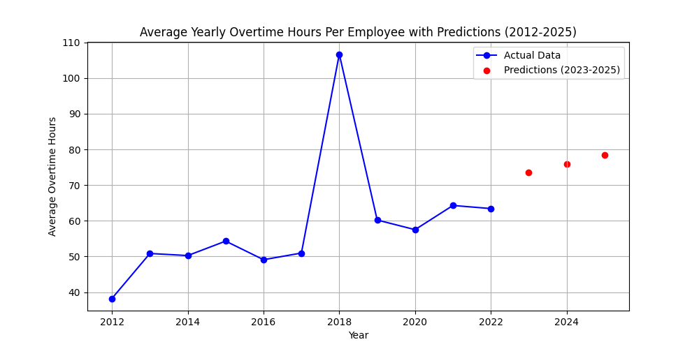
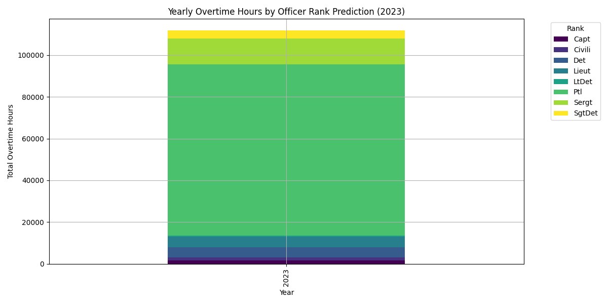

## Guiding Question

Given previous overtime data, predict the amount of overtime paid for the next year. How does this compare with the budget allocation for the BPD?

---

## Overtime Per Employee Distributions

### Goal

Find the distributions of overtime per employee and how they differ over the last 10 years to see if there are any trends/outliers

### Data Processing

- Load data from 2012 - 2022 CSV files, grouping by employee ID
- Determine X and Y axis limits for global scaling for the final animation

### Data Modeling Method

- Histogram based distribution modeling
  - Normalized to represent a PDF
  - 50 bins
- Added mean + median visualizations
- FuncAnimation to animate the changes in probability distributions across years for better visualization
- Box plot to visualize 2018 as an outlier

---

## Linear Regression

### Goal

Identify trends and model the relationship between years and overtime data to make predictions for the future

### Data Processing

- Loaded yearly overtime data (2012-2022) from CSV files
- Summed overtime hours for each year and stored in a list
- Checked if data exists before proceeding

### Data Modeling

- Used Linear Regression to model overtime trends over the years
- Trained the model on the years (2012-2022) and their respective overtime totals
- Used model to predict years 2023, 2024, 2025 for both average hours per employee and total hours

---

## Random Forest Regression Model

### Goal

Predict total overtime hours for different officer ranks and task assignments in 2023 using historical data (2012–2022)

### Data Processing

- Load yearly CSV files (2012–2022) and combine them into a single dataset
- Convert OTDATE to a datetime object
- Encode categorical variables (RANK and ASSIGNED_DESC) using LabelEncoder
- Saved categorical variable mappings for ASSIGNED_DESC in ./analysis/overtime/csv/assigned_mapping_key.csv

### Data Modeling

- Features (X): Year, Rank_Encoded, Assigned_Encoded
- Target (y): Total overtime hours (OTHOURS)
- Train Model: Use Random Forest Regressor on data from 2012–2022
- Inputted all possible combinations of officer rank and officer assignment into the trained model

---

## Preliminary Results

- We see 2018 is statistically an outlier in terms of average overtime per employee
- Otherwise, we see the mean overtime per employee per year hovers around 53.91 hours with a standard deviation of 7.82
- Excluding the outlier year, the distributions of overtime per employee per year is relatively stable
- The linear regression data suggests a slight increase in overtime hours in 2023, 2024, and 2025
  - 2018 data may skew the model
  - Accuracy may be lower due to small sample size of 10 years
- The Ramdom Forest Regression model suggests that patrol rank officers take the majority of the overtime hours while the LtDet rank officers take the least overtime
- The heatmap suggests that Districts 01 - 18 were the task assgnments which caused the highest levels of overtime across different police ranks
