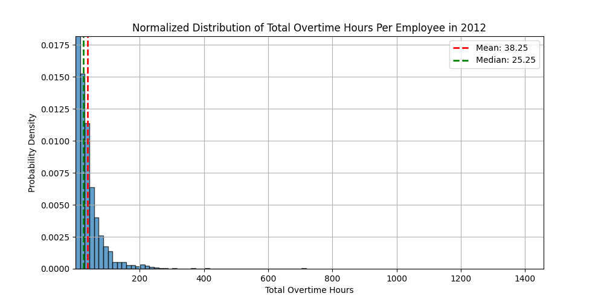
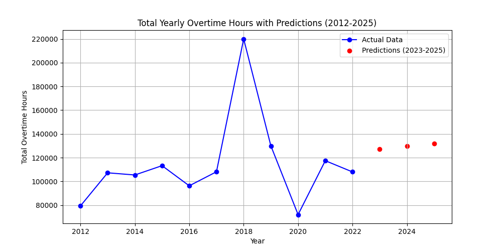
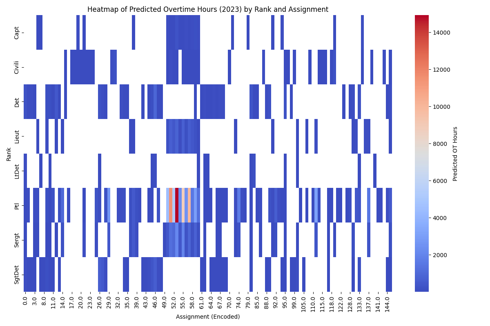

## Guiding Question

Given previous overtime data, predict the amount of overtime paid for the next year. How does this compare with the budget allocation for the BPD?

---

## Overtime Per Employee Distributions

### Goal

Find the distributions of overtime per employee and how they differ over the last 10 years to see if there are any trends/outliers

### Data Processing

- Load data from 2012 - 2022 CSV files, grouping by employee ID
- Determine X and Y axis limits for global scaling for the final animation

### Data Modeling Method

- Histogram based distribution modeling
  - 50 bins
  - Normalized to represent a PDF
- Added mean and medians to each graph
- Used FuncAnimation to animate the changes in probability distributions across years for better visualization
- Used box plot to visualize 2018 as an outlier

### Preliminary Results

- We see that 2018 is statistically an outlier in terms of average overtime per employee
- Otherwise, we see the mean overtime per employee per year hovers around 53.91 hours with a standard deviation of 7.82
- Excluding the outlier year, the distribution of overtime per employee per year is relatively stable

---

## Preliminary Data Visualizations

---

## Description of Data Processing

- ***

## Description of Data Modeling Methods

---

## Preliminary Results

---

## Video Presentation
