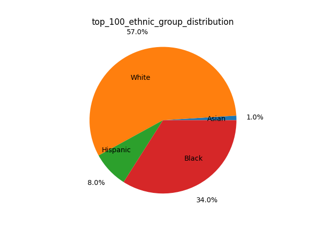
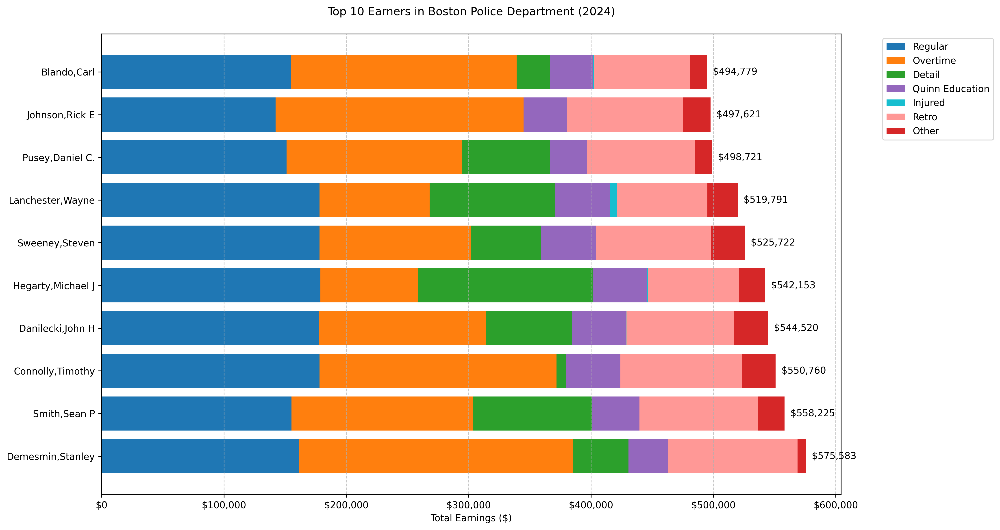

# CS506 Project – Police Overtime Final Report

### Contributors: Kyle Yu, Wyatt Napier, Eric Nohara-LeClair, Ba Tien (Tien) Le

# Video Link

Video link here...

---

# Main Goal

- Analyze how the BDP budget gets spent, with a specific interest in overtime
- Synthesize recommendations on the allocation of overtime funds based off of our findings

---

# Building and Running Code

```
conda env create -f environment.yml
conda activate myenv
```

- Include Makefile maybe

---

# Final Project Report: Wyatt

## Description of Data Processing

For the roster data, there were many categorical columns which I then one-hot encoded such as 'Sex' and 'Ethnic Grp'. I used the pandas get dummies function to do so. After that, I continued on to encode the job titles. There were at least 9 different rankings of officers that were clear from observing the data:

1. Commissioner
2. Supn-In Chief
3. Supn Bpd
4. Dep Supn
5. Police Captain
6. Police Lieutenant
7. Police Sergeant
8. Police Detective
9. Police Officer
10. other

However, one limitation of this method of grouping the job titles is that there were more specific listings under "Police Officer" which leads to a larger variation in pay, even though Police Officer is the lowest ranking.

I also used the earnings data from 2020, which matched the year of the roster data, and by merging these two datasets on the cleaned names of employees I was able to extract demographic information about the top earners at the BPD. For that earning data to be useful, I used Tien's preprocessing to extract just the BPD employees.

I also calculated the amount of time that the each person has been employed at the time of the sheet's creation by calculating the difference between the 'Eff Date' column and 'As Of' column, but this yielded results that had very little variation so it seemed that it wouldn't add much to our investigation of the dataset.

## Description of Data Modeling Methods

For my initial visualizations, most of my data modeling methods aimed to capture the relationships between features within the BPD roster data using matplotlib. I was also able to use plotly to generate interactive plots where you can hover over each datapoint to ascertain more information about that person such as their ethnicity and specific job title. Finally, I also generated a decision tree as a more interpretable method of inspecting who qualifies as a high earner based on their demographics and job title.

## Data Visualizations


#### Takeaways

Although 86.2\% of the Boston Police Department is male, 96 of the 100 top earners are male. This showcases very obvious gender pay inequity among the top earners, which may be exacerbated by the imbalance in gender representation in the BPD.




#### Takeaways

Here, white people make up 65% of the overall police force, but interestingly, they only represent 57% of the top earners. Instead, top earning Black members of the BPD outshine their representation within the overall police department. However, Asian and Hispanic members of the BPD still suffer as the most marginalized communities.

<!--  -->


<!--  -->

#### Takeaways

Although income rates with respect to job titles have the smae relationship in both hourly and monthly timeframe, they differ greatly with respect to annual income which leads me to believe that there is something fishy going on with other sources of income besides standard rate.


#### Takeaways

As you might expect, those with higher ranking (and thus have lower job title index, which you can see above) are more likely to be high earners, which is captured by the root node as well as the left node in the second layer. Also, the right node in the second layer shows that if you are a woman (Sex_M $\leq 0.5$) then you are more likely to be classified as a low earner than a man of a similar position who may be a high earner.

## Overall Results

In general, I saw that there is a large issue of pay inequity in the Boston Police Department and that women are often simply making less than men. Interestingly, there seems to be less inequity with regard to ethnicity of employees. On top of this, as my teammates will explore shortly, there are also some suspicious activities with regard to other sources of income besides base hourly/monthly rate.

---

# Final Project Report: Tien

## Introduction

The Boston Police Department (BPD) budget has undergone various changes over the years. This project aims to analyze how the budget is allocated and spent, with a specific interest in overtime pay.

## Figures and Results:


**Takeaways**

- The BPS budget saw approximately 30% increase in 2024.


**Takeaways**

- To identify the areas from which the increase comes, I look at the breakdown of the BPD budget from 2011 to 2024. There are major increases in regular pay, overtime pay, and retro pay.


**Takeaways**

- The BPS budget drop in 2014 is a significant one.
- BPD and BFD both had steady increases in budget, yet BFD did not see a 30% increase like BPD in 2024, as shown in the first figure.
- BPL funding remained relatively low and stable compared to other departments.


**Takeaways**

- BPD has the strongest increasing trend overall and in overtime pay.
- BPP overtime pay amount and rate of increase are also the largest.

## Future Work

- Identifying which overtime events consume the most budget (e.g., court appearances, holidays, Christmas, etc.). Identify other relevant aspects of BPD budget allocation that also see a strong increase (retro pay, etc.) and compare them to other departments.
- **Linear Regression:** Predict the amount of overtime paid for the next year based on historical trends.
- **Maximum Likelihood Estimation (MLE):** Estimate key parameters related to budget distribution.
- **Clustering Methods:** Identify patterns in overtime spending based on location and event types.
- **Geospatial Analysis:** Map incidents to show where the highest concentration of overtime-inducing events occur.

---

# Final Project Report: Eric

## Guiding Question

Given previous overtime data, predict the amount of overtime paid for the next year. How does this compare with the budget allocation for the BPD?

## Overtime Per Employee Distributions


### Goal

Find the distributions of overtime per employee and how they differ over the last 10 years to see if there are any trends/outliers

### Data Processing

- Load data from 2012 - 2022 CSV files, grouping by employee ID
- Determine X and Y axis limits for global scaling for the final animation

### Data Modeling Method

- Histogram based distribution modeling
  - Normalized to represent a PDF
  - 50 bins
- Added mean + median visualizations
- FuncAnimation to animate the changes in probability distributions across years for better visualization
- Box plot to visualize 2018 as an outlier

## Linear Regression


### Goal

Identify trends and model the relationship between years and overtime data to make predictions for the future

### Data Processing

- Loaded yearly overtime data (2012-2022) from CSV files
- Summed overtime hours for each year and stored in a list
- Checked if data exists before proceeding

### Data Modeling

- Used Linear Regression to model overtime trends over the years
- Trained the model on the years (2012-2022) and their respective overtime totals
- Used model to predict years 2023, 2024, 2025 for both average hours per employee and total hours

## Random Forest Regression Model


### Goal

Predict total overtime hours for different officer ranks and task assignments in 2023 using historical data (2012–2022)

### Data Processing

- Load yearly CSV files (2012–2022) and combine them into a single dataset
- Convert OTDATE to a datetime object
- Encode categorical variables (RANK and ASSIGNED_DESC) using LabelEncoder
- Saved categorical variable mappings for ASSIGNED_DESC in ./analysis/overtime/csv/assigned_mapping_key.csv
- NOTE: use this key when interpreting the heat map

### Data Modeling

- Features (X): Year, Rank_Encoded, Assigned_Encoded
- Target (y): Total overtime hours (OTHOURS)
- Train Model: Use Random Forest Regressor on data from 2012–2022
- Inputted all possible combinations of officer rank and officer assignment into the trained model

## Department Overtime Analysis


### Goal

Find any relationships between department and overtime earnings over the last 10 years in order to better understand how to allocate the overtime budget to different departments.

### Data Processing

- Reformat CSV files for earnings with consistent column headers
- Load yearly earnings CSV files in /data/earnings-reformatted
- Combine yearly data from the last 10 years
- Reformat all numeric columns in the earnings data to turn strings of the format "$1,000,000" into numeric values
- Group by department and find total earnings and overtime earnings / total earnings ratio for each department

## Results

- We see 2018 is statistically an outlier in terms of average overtime per employee
- Otherwise, we see the mean overtime per employee per year hovers around 53.91 hours with a standard deviation of 7.82
- Excluding the outlier year, the distributions of overtime per employee per year is relatively stable
- The linear regression data suggests a slight increase in overtime hours in 2023, 2024, and 2025
  - We can expect around 140,000 - 150,000 overtime hours in the near future
  - 2018 data may skew the model
  - Accuracy may be lower due to small sample size of 10 years
- The Ramdom Forest Regression model suggests that patrol rank officers take the majority of the overtime hours while the LtDet rank officers take the least overtime
- The heatmap suggests that Districts 01 - 18 were the task assgnments which caused the highest levels of overtime across different police ranks, with District 4 in particular contributing the most to overtime hours across police ranks
- Most departments do not earn significant amounts of their total earnings from overtime, with most departments earning less than $10,000,000 in total overtime over the last 10 years
- BPD, Boston Fire Department, and Public Works were among the top overtime earners across all departments, with BPD in particular earning more than double the second highest earner, with almost $1,000,000,000 over the last 10 years

---

# Final Project Report: Kyle

## Data Visualizations




## Description of Data Processing

For the earnings data, I worked with multiple CSV files containing Boston Police Department earnings records from 2012 to 2024. One of the main challenges was dealing with inconsistent column naming across different years. I standardized these by mapping various versions to consistent names - for example, 'TOTAL EARNINGS' to 'TOTAL GROSS', 'QUINN' to 'QUINN_EDUCATION', and variations of 'DEPARTMENT' to 'DEPARTMENT_NAME'.

The data also required significant cleaning due to formatting inconsistencies. Many monetary values were stored as strings with dollar signs and commas, which I converted to numeric types for analysis. I also handled NaN values and data type inconsistencies that appeared in different years' files. For each year's data, I filtered specifically for police department employees to focus our analysis on BPD personnel.

## Description of Data Modeling Methods

For my initial visualizations, I focused on creating three main types of analyses using matplotlib and pandas. First, I created a line plot tracking mean earnings trends to show the overall growth in compensation over time. Second, I generated histograms comparing the distribution of earnings between 2012 and 2024 to understand how the spread of salaries has evolved. Finally, I implemented a horizontal bar chart showing the top 10 earners and their pay component breakdown for 2024.

## Results

From my visualizations, I observed several interesting trends in BPD compensation. The mean earnings analysis shows steady growth from $97,515 in 2012 to $131,321 in 2018, with an average annual increase of 4.2% that outpaces inflation. This growth isn't uniform across all officers though - the distribution analysis reveals growing income inequality within the department, with a more pronounced right skew in 2024 and more high-earning outliers.

Looking at the top earners in 2024, we see that the highest-paid officers earned over $575,000 annually, with overtime and detail work often contributing significantly to their total compensation. The Quinn Education incentives also play a notable role, with some officers receiving substantial educational bonuses. Perhaps most notably, injury-related pay has shown significant increases, and the 2024 data reveals a substantial amount of retroactive pay among top earners.

## Next Steps

Moving forward, I want to develop more sophisticated analyses of the earnings data. One priority is creating predictive models for future earnings trends and overtime allocation. I'm particularly interested in using regression analysis to identify which factors contribute most strongly to an officer becoming a high earner. Additionally, I want to investigate the relationship between rank/position and earnings components, as well as study how education levels impact total compensation.

---

# Final Conclusion + Recommendations to BPD

Our analysis explores the BPD overtime budget in a historical context, highlighting pay equity concerns, overtime allocation, and many different factors which had large impacts on overtime pay. It is clear that there is a need for a more strategic approach to the BPD budget allocation. Key findings include:

1. **Pay Equity:** Significant gender and ethnicity disparities exist among top earners in BPD.

2. **Overtime Management:** Overtime hours are projected to reach 140,000-150,000 hours in upcoming years, with patrol officers in District 4 contributing the most. BPD makes by far the highest total overtime earnings, along with Boston Fire Department and Public Works. The majority of other departments earn virtually none of their earnings from overtime pay. Injury pay is the largest category of overtime costs, signaling a need for improved injury management. Court overtime is another significant contributor to total overtime costs.

3. **Geographic and Crime-Based Allocation:** High-crime districts need more flexible overtime policies, while low-crime areas should implement stricter caps and officer reassignment to reduce unnecessary overtime.

Recommendations:

1. **Promote Diversity in High-Earning Roles:** Focus on increasing women and minority representation in roles that lead to higher compensation in BPD.

2. **Control Overtime Spending:** Set a soft cap of 140,000 overtime hours annually and implement a strict approval process based on rank, district, and department.

3. **Dynamic Overtime Policies:** Use crime rates to adjust overtime policies, with flexible spending in high-crime areas and strict caps in low-crime areas.

4. **Track Special Event Overtime:** Separate overtime for special events and use historical data to forecast future staffing needs and prevent overspending.

By implementing these measures, BPD can ensure more efficient, equitable, and strategic use of overtime funds.
