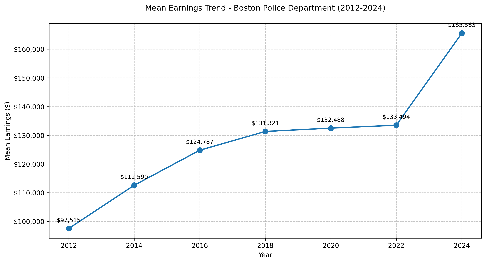
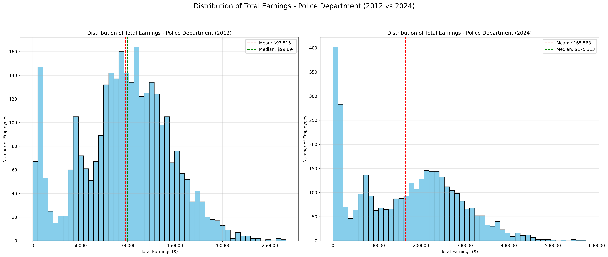
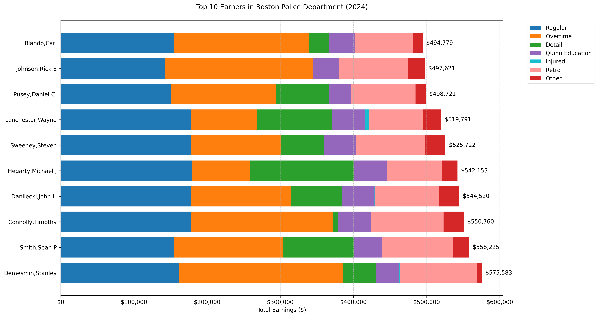

# Midterm Project Report: Kyle

## Preliminary Data Visualizations

## Description of Data Processing

For the earnings data, I worked with multiple CSV files containing Boston Police Department earnings records from 2012 to 2024. One of the main challenges was dealing with inconsistent column naming across different years. I standardized these by mapping various versions to consistent names - for example, 'TOTAL EARNINGS' to 'TOTAL GROSS', 'QUINN' to 'QUINN_EDUCATION', and variations of 'DEPARTMENT' to 'DEPARTMENT_NAME'. 

The data also required significant cleaning due to formatting inconsistencies. Many monetary values were stored as strings with dollar signs and commas, which I converted to numeric types for analysis. I also handled NaN values and data type inconsistencies that appeared in different years' files. For each year's data, I filtered specifically for police department employees to focus our analysis on BPD personnel.

## Description of Data Modeling Methods

For my initial visualizations, I focused on creating three main types of analyses using matplotlib and pandas. First, I created a line plot tracking mean earnings trends to show the overall growth in compensation over time. Second, I generated histograms comparing the distribution of earnings between 2012 and 2024 to understand how the spread of salaries has evolved. Finally, I implemented a horizontal bar chart showing the top 10 earners and their pay component breakdown for 2024.

The visualizations required careful consideration of color schemes and layouts to make the data easily interpretable. For the earnings distributions, I aligned the scales to make direct comparisons possible between years. For the top earners visualization, I used distinct colors to represent different types of compensation, making it easy to see how various components contribute to total earnings.

## Preliminary Results

From my visualizations, I observed several interesting trends in BPD compensation. The mean earnings analysis shows steady growth from $97,515 in 2012 to $131,321 in 2018, with an average annual increase of 4.2% that outpaces inflation. This growth isn't uniform across all officers though - the distribution analysis reveals growing income inequality within the department, with a more pronounced right skew in 2024 and more high-earning outliers.

Looking at the top earners in 2024, we see that the highest-paid officers earned over $575,000 annually, with overtime and detail work often contributing significantly to their total compensation. The Quinn Education incentives also play a notable role, with some officers receiving substantial educational bonuses. Perhaps most notably, injury-related pay has shown significant increases, and the 2024 data reveals a substantial amount of retroactive pay among top earners.

## Next Steps

Moving forward, I want to develop more sophisticated analyses of the earnings data. One priority is creating predictive models for future earnings trends and overtime allocation. I'm particularly interested in using regression analysis to identify which factors contribute most strongly to an officer becoming a high earner.

I also plan to conduct comparative analyses with other major city police departments to understand how BPD's compensation structure and levels compare. This could help contextualize our findings about income inequality and the shift toward variable compensation. Additionally, I want to investigate the relationship between rank/position and earnings components, as well as study how education levels impact total compensation.

Another important area for investigation is policy impact. I'd like to evaluate the effectiveness of the Quinn Education incentives and analyze how overtime distribution patterns relate to staffing levels. The dramatic increase in injury-related pay and the recent spike in retroactive pay also merit deeper investigation to understand their underlying causes.
