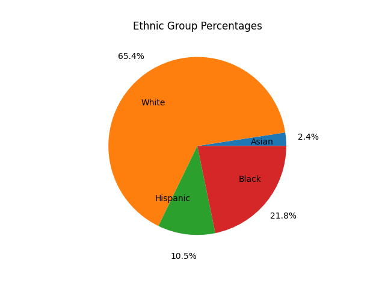
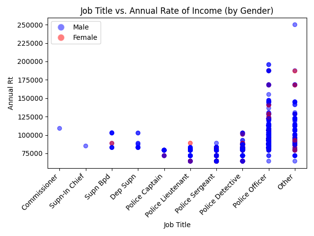

# CS506 Project – Police Overtime Midterm Report

### Contributors: Kyle Yu, Wyatt Napier, Eric Nohara-LeClair, Ba Tien (Tien) Le

---

## Preliminary Data Visualizations

## Description of Data Processing

For the roster data, there were many categorical columns which I then one-hot encoded such as 'Sex' and 'Ethnic Grp'. I used the pandas get dummies function to do so. After that, I continued on to encode the job titles. There were at least 9 different rankings of officers that were clear from observing the data:

1. Commissioner
2. Supn-In Chief
3. Supn Bpd
4. Dep Supn
5. Police Captain
6. Police Lieutenant
7. Police Sergeant
8. Police Detective
9. Police Officer
10. other

However, one limitation of this method of grouping the job titles is that there were more specific listings under "Police Officer" which leads to a larger variation in pay, even though Police Officer is the lowest ranking.

I also calculated the amount of time that the each person has been employed at the time of the sheet's creation by calculating the difference between the 'Eff Date' column and 'As Of' column, but this yielded results that had very little variation so it seemed that it wouldn't add much to our investigation of the dataset.

## Description of Data Modeling Methods

For my initial visualizations, most of my data modeling methods aimed to capture the relationships between features within the BPD roster data using matplotlib. I was also able to use plotly to generate interactive plots where you can hover over each datapoint to ascertain more information about that person such as their ethnicity and specific job title.

## Preliminary Results

From my visualizatioins, I observed that the BPD primarily consists of white men. Then, I was able to deduce that, although hourly rate and montly rate are linearly correlated, annual rate isn't. This was particularly interesting to note when plotted across with job titles on the x axis, because surprisingly, those that made the most annually weren't the highest ranking. In fact, some of them were police officers. Additonally, it seems that women are making less than men.

## Next steps

In the future, I want to try to implement Decision Trees to predict an employee's annual income. From this, we will have an easily intererpretable model for the characteristics of employees that have an annual income within a specific bucket. I also want to take a deeper dive into the additional sources of income besides hourly or monthly rate that is boosting the annual rate of some of these specific employees.

## Video Presentation

---
