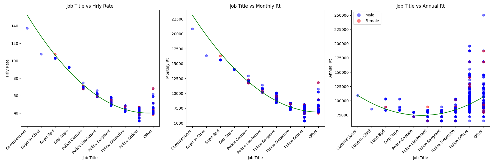
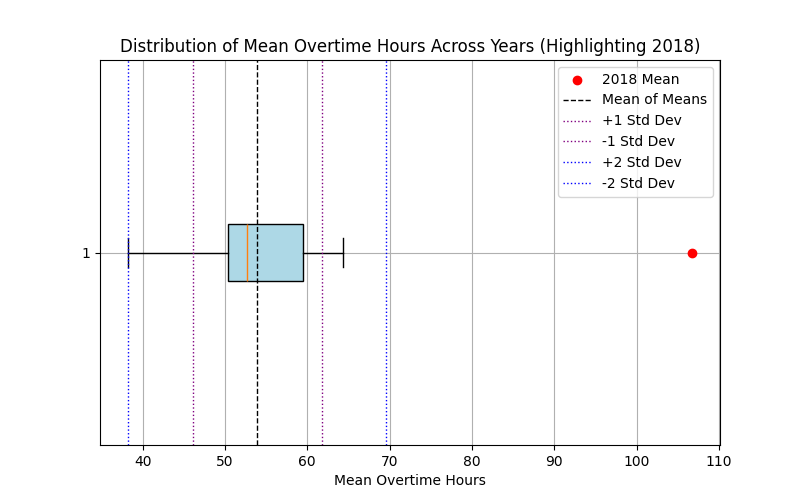

# CS506 Project – Police Overtime Midterm Report

### Contributors: Kyle Yu, Wyatt Napier, Eric Nohara-LeClair, Ba Tien (Tien) Le

---

# Midterm Project Report: Wyatt

## Preliminary Data Visualizations

## Description of Data Processing

For the roster data, there were many categorical columns which I then one-hot encoded such as 'Sex' and 'Ethnic Grp'. I used the pandas get dummies function to do so. After that, I continued on to encode the job titles. There were at least 9 different rankings of officers that were clear from observing the data:

1. Commissioner
2. Supn-In Chief
3. Supn Bpd
4. Dep Supn
5. Police Captain
6. Police Lieutenant
7. Police Sergeant
8. Police Detective
9. Police Officer
10. other

However, one limitation of this method of grouping the job titles is that there were more specific listings under "Police Officer" which leads to a larger variation in pay, even though Police Officer is the lowest ranking.

I also calculated the amount of time that the each person has been employed at the time of the sheet's creation by calculating the difference between the 'Eff Date' column and 'As Of' column, but this yielded results that had very little variation so it seemed that it wouldn't add much to our investigation of the dataset.

## Description of Data Modeling Methods

For my initial visualizations, most of my data modeling methods aimed to capture the relationships between features within the BPD roster data using matplotlib. I was also able to use plotly to generate interactive plots where you can hover over each datapoint to ascertain more information about that person such as their ethnicity and specific job title.

## Preliminary Results

From my visualizatioins, I observed that the BPD primarily consists of white men. Then, I was able to deduce that, although hourly rate and montly rate are linearly correlated, annual rate isn't. This was particularly interesting to note when plotted across with job titles on the x axis, because surprisingly, those that made the most annually weren't the highest ranking. In fact, some of them were police officers. Additonally, it seems that women are making less than men.

## Next steps

In the future, I want to try to implement Decision Trees to predict an employee's annual income. From this, we will have an easily intererpretable model for the characteristics of employees that have an annual income within a specific bucket. I also want to take a deeper dive into the additional sources of income besides hourly or monthly rate that is boosting the annual rate of some of these specific employees.

# Midterm Project Report: Tien

## Introduction

The Boston Police Department (BPD) budget has undergone various changes over the years. This project aims to analyze how the budget is allocated and spent, with a specific interest in overtime pay.

## Figures and Results:

**Takeaways**

- The BPS budget saw approximately 30% increase in 2024.

**Takeaways**

- To identify the areas from which the increase comes, I look at the breakdown of the BPD budget from 2011 to 2024. There are major increases in regular pay, overtime pay, and retro pay.

**Takeaways**

- The BPS budget drop in 2014 is a significant one.
- BPD and BFD both had steady increases in budget, yet BFD did not see a 30% increase like BPD in 2024, as shown in the first figure.
- BPL funding remained relatively low and stable compared to other departments.

**Takeaways**

- BPD has the strongest increasing trend overall and in overtime pay.
- BPP overtime pay amount and rate of increase are also the largest.

## Future Work

- Identifying which overtime events consume the most budget (e.g., court appearances, holidays, Christmas, etc.). Identify other relevant aspects of BPD budget allocation that also see a strong increase (retro pay, etc.) and compare them to other departments.
- **Linear Regression:** Predict the amount of overtime paid for the next year based on historical trends.
- **Maximum Likelihood Estimation (MLE):** Estimate key parameters related to budget distribution.
- **Clustering Methods:** Identify patterns in overtime spending based on location and event types.
- **Geospatial Analysis:** Map incidents to show where the highest concentration of overtime-inducing events occur.

# Midterm Project Report: Eric

## Guiding Question

Given previous overtime data, predict the amount of overtime paid for the next year. How does this compare with the budget allocation for the BPD?

---

## Overtime Per Employee Distributions

### Goal

Find the distributions of overtime per employee and how they differ over the last 10 years to see if there are any trends/outliers

### Data Processing

- Load data from 2012 - 2022 CSV files, grouping by employee ID
- Determine X and Y axis limits for global scaling for the final animation

### Data Modeling Method

- Histogram based distribution modeling
  - Normalized to represent a PDF
  - 50 bins
- Added mean + median visualizations
- FuncAnimation to animate the changes in probability distributions across years for better visualization
- Box plot to visualize 2018 as an outlier

---

## Linear Regression

### Goal

Identify trends and model the relationship between years and overtime data to make predictions for the future

### Data Processing

- Loaded yearly overtime data (2012-2022) from CSV files
- Summed overtime hours for each year and stored in a list
- Checked if data exists before proceeding

### Data Modeling

- Used Linear Regression to model overtime trends over the years
- Trained the model on the years (2012-2022) and their respective overtime totals
- Used model to predict years 2023, 2024, 2025 for both average hours per employee and total hours

---

## Random Forest Regression Model

### Goal

Predict total overtime hours for different officer ranks and task assignments in 2023 using historical data (2012–2022)

### Data Processing

- Load yearly CSV files (2012–2022) and combine them into a single dataset
- Convert OTDATE to a datetime object
- Encode categorical variables (RANK and ASSIGNED_DESC) using LabelEncoder
- Saved categorical variable mappings for ASSIGNED_DESC in ./analysis/overtime/csv/assigned_mapping_key.csv

### Data Modeling

- Features (X): Year, Rank_Encoded, Assigned_Encoded
- Target (y): Total overtime hours (OTHOURS)
- Train Model: Use Random Forest Regressor on data from 2012–2022
- Inputted all possible combinations of officer rank and officer assignment into the trained model

---

## Preliminary Results

- We see 2018 is statistically an outlier in terms of average overtime per employee
- Otherwise, we see the mean overtime per employee per year hovers around 53.91 hours with a standard deviation of 7.82
- Excluding the outlier year, the distributions of overtime per employee per year is relatively stable
- The linear regression data suggests a slight increase in overtime hours in 2023, 2024, and 2025
  - 2018 data may skew the model
  - Accuracy may be lower due to small sample size of 10 years
- The Ramdom Forest Regression model suggests that patrol rank officers take the majority of the overtime hours while the LtDet rank officers take the least overtime
- The heatmap suggests that Districts 01 - 18 were the task assgnments which caused the highest levels of overtime across different police ranks

## Video Presentation

---
